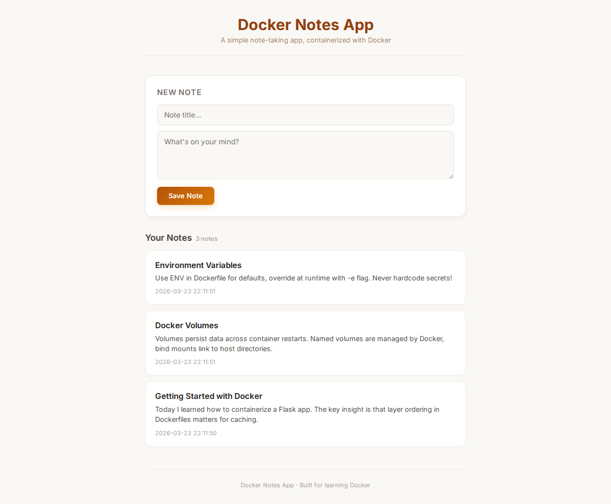

# Docker Notes App - Learn Docker

> **Hands-on exercise**: Containerize a Flask note-taking app and learn the core Docker concepts - Dockerfiles, image building, volumes, and optimization.



## What You'll Learn

- [ ] Writing a Dockerfile from scratch
- [ ] Building and running Docker images
- [ ] Using volumes to persist data across container restarts
- [ ] Environment variables in Docker
- [ ] Optimizing Docker images (bonus)

## Prerequisites

- Docker installed ([install guide](https://docs.docker.com/get-docker/))
- Basic comfort with the terminal
- No Python knowledge required - the app code is provided

## Getting Started

```bash
git clone https://github.com/CarmitHaas/docker-notes-app.git
cd docker-notes-app
```

## The App

This is a simple Flask web application for taking notes. It stores notes as JSON in a file and serves a clean web interface.

**Before containerizing, take a look at the code:**

- `app.py` - The Flask application (read the environment variables and file paths)
- `templates/index.html` - The web interface
- `requirements.txt` - Python dependencies

Notice in `app.py`:
- The app runs on **port 5000**
- It reads `NOTES_FILE` and `APP_NAME` from **environment variables**
- Notes are stored in a JSON file at `/data/notes.json`

## Your Mission

**Write a Dockerfile** that containerizes this application so it runs in a Docker container.

When you're done, you should be able to:
1. Build the image with `docker build`
2. Run it with `docker run`
3. Access the app at http://localhost:5000
4. Add notes and see them persist

## Think About...

- What **base image** should you use for a Python app? Does it need to be full-sized?
- In what **order** should you copy files to maximize Docker's layer caching? (Hint: what changes less often - the dependencies or the app code?)
- The app stores data in `/data/notes.json`. What happens to that data when the container stops? How can you **persist** it?
- The app uses environment variables. Should you set them in the Dockerfile, at runtime, or both?
- Which files does the container **actually need**? Do you need the README inside it?

## Hints

<details>
<summary>Hint 1: Base image</summary>

`python:3.9-slim` is a good choice - it has Python pre-installed and is much smaller than the full `python:3.9` image. For even smaller, try `python:3.9-alpine`.

</details>

<details>
<summary>Hint 2: Layer caching strategy</summary>

Copy and install `requirements.txt` BEFORE copying your app code:

```dockerfile
COPY requirements.txt .
RUN pip install --no-cache-dir -r requirements.txt
COPY . .
```

This way, Docker caches the dependency installation layer. When you change `app.py`, Docker doesn't reinstall all packages - it reuses the cached layer.

</details>

<details>
<summary>Hint 3: Persistent data with volumes</summary>

The app writes notes to `/data/notes.json`. To persist this data, run the container with a **volume mount**:

```bash
docker run -v notes-data:/data -p 5000:5000 notes-app
```

The named volume `notes-data` will survive container stops and removals.

</details>

<details>
<summary>Hint 4: Environment variables</summary>

You can set defaults in the Dockerfile with `ENV`:

```dockerfile
ENV NOTES_FILE=/data/notes.json
ENV APP_NAME="Docker Notes App"
```

Users can override these at runtime with `docker run -e APP_NAME="My Notes"`.

</details>

<details>
<summary>Hint 5: Full Dockerfile structure</summary>

Your Dockerfile needs these instructions (in order):
1. `FROM` - base image
2. `WORKDIR` - set working directory
3. `COPY requirements.txt .` + `RUN pip install` - install dependencies (cached layer)
4. `COPY . .` - copy app code
5. `ENV` - set environment variables
6. `EXPOSE` - document the port
7. `CMD` or `ENTRYPOINT` - run the app

</details>

## Verify It Works

You'll know you've succeeded when:

1. **Build succeeds**: `docker build -t notes-app .` completes without errors
2. **Container runs**: `docker run -p 5000:5000 notes-app` starts the Flask server
3. **App works**: http://localhost:5000 shows the notes interface
4. **Notes save**: Adding a note and refreshing the page still shows it
5. **Data persists**: Run with a volume, stop the container, start it again - notes are still there

### Test persistence:

```bash
# Run with a named volume
docker run -d -p 5000:5000 -v notes-data:/data --name my-notes notes-app

# Add some notes in the browser, then:
docker stop my-notes && docker rm my-notes

# Start a new container with the same volume
docker run -d -p 5000:5000 -v notes-data:/data --name my-notes notes-app

# Your notes should still be there!
```

## Key Takeaways

- **Dockerfiles** are recipes for building container images - every line creates a layer
- **Layer ordering matters**: Put things that change rarely (dependencies) before things that change often (app code) to maximize caching
- **Volumes** are how containers persist data - without them, everything is lost when the container stops
- **Environment variables** make your containers configurable without rebuilding the image
- These patterns (multi-layer caching, volumes for persistence, ENV for configuration) are used in every production Docker deployment

## Solution

Ready to check your work?

```bash
git checkout solution
```

## Bonus Challenges

1. **Optimize the image**: Use `python:3.9-alpine` as the base image. How much smaller is it?
2. **Add a HEALTHCHECK**: Add `HEALTHCHECK CMD curl -f http://localhost:5000/ || exit 1` to your Dockerfile
3. **Create a .dockerignore**: Prevent unnecessary files from being copied into the image
4. **Custom app name**: Run the container with `-e APP_NAME="My Personal Notes"` and verify it appears in the UI
5. **Compare image sizes**: Run `docker images` and compare the sizes of different base images

---

*[Carmit Haas](https://github.com/CarmitHaas) | DevOps Engineer & Lead Instructor*
